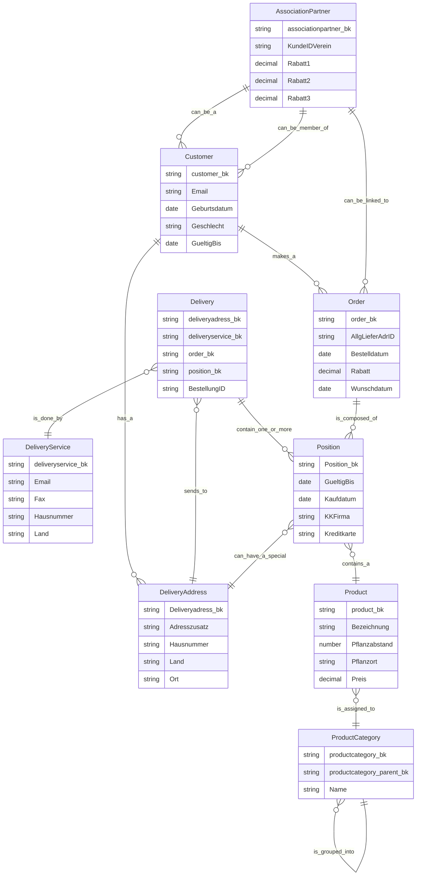

# Willibald Conceptual Entity Diagram

## Business Entity Relationships

## Entity Descriptions

### AssociationPartner
Garden association or club that has a partnership agreement with Willibald. Members receive special discounts. The association is represented by a customer contact person.

### Customer
Individual or organization that purchases seeds, plants, and gardening products from the Willibald shop. Customers can place orders through webshop or roadshow channels, have delivery addresses, and may be members of partner associations. Historical residence information is tracked as multi-active attributes.

### Delivery
Physical shipment record tracking when and how positions are delivered. Links orders and positions to delivery addresses and delivery services. Contains the actual delivery date for adherence tracking.

### DeliveryAddress
Physical address where deliveries can be sent. Customers can have multiple delivery addresses. Addresses can be used as general order addresses or special position addresses.

### DeliveryService
Logistics provider or carrier company that handles physical delivery of orders. Delivery services have contact information and address details for coordination.

### Order
Purchase transaction from customer requesting products. Orders originate from webshop or roadshow channels, contain one or more positions, and may be linked to associations for roadshow orders.

### Position
Individual line item within an order representing a specific product with quantity and pricing. Positions may have special delivery addresses and payment details, particularly for roadshow orders.

### Product
Item available for purchase in the Willibald catalog including seeds, plants, tools, and gardening supplies. Each product has pricing, planting information, and belongs to a product category.

### ProductCategory
Hierarchical classification system for organizing products. Categories can have parent categories creating a multi-level taxonomy for seeds, plants, tools, and accessories.
