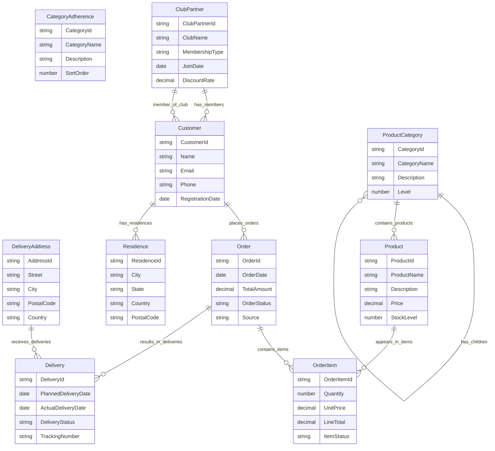

# Willibald Conceptual Entity Diagram

## Business Entity Relationships

## Entity Descriptions

### CategoryAdherence
Reference data defining delivery performance categories. Used to classify deliveries as on-time, early, or late. This is a static lookup table maintained by business rules.

### ClubPartner
Garden club or association that has a partnership agreement with Willibald. Members of partner clubs receive special discounts and benefits.

### Customer
Individual or organization that purchases seeds, plants, and gardening products from the Willibald shop. Customers can place orders, have multiple delivery addresses, and may be members of garden clubs.

### Delivery
Physical shipment of products to fulfill one or more orders. Tracks expected and actual delivery dates, shipping status, and performance against delivery commitments.

### DeliveryAddress
Physical address where deliveries can be sent. Customers may have multiple delivery addresses and addresses can receive multiple deliveries.

### Order
Purchase transaction representing a customer's request to buy products. Orders can originate from the webshop or roadshow events, contain multiple items, and result in one or more deliveries.

### OrderItem
Individual line item within an order representing a specific product, quantity, and price. Each order item links a product to an order with purchase details.

### Product
Item available for purchase in the Willibald catalog, including seeds, plants, tools, and gardening supplies. Each product belongs to a category and has pricing and inventory information.

### ProductCategory
Hierarchical classification system for organizing products. Categories can have parent categories creating a multi-level taxonomy.

### Residence
Historical record of where a customer has lived over time. Used for customer analytics and regional marketing campaigns. This is a temporal entity tracking address changes.
